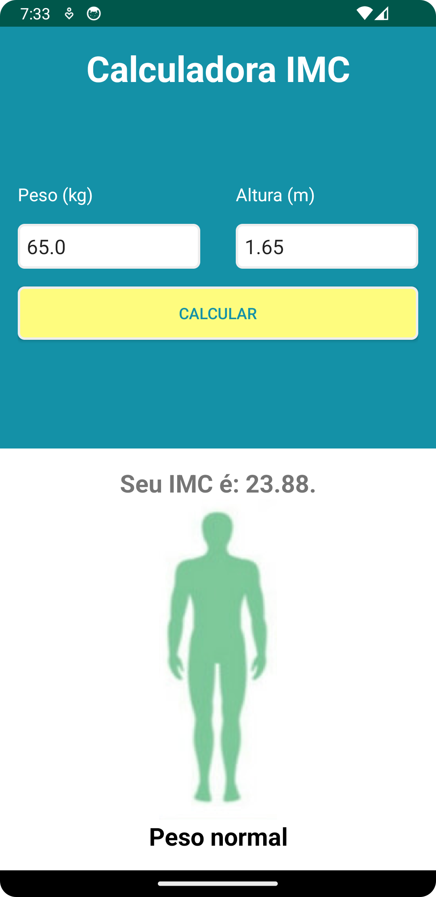

# IMC

## Este é o segundo App feito na Parte de android no MBA in Mobile Development que estou cursando na fiap FIAP, Lecionado pelo [Heider Lopes](https://github.com/heiderlopes)

  
  

### É o clássico App de calcular IMC, Você coloca suas informações no app (peso e altura) e ele traz o resultado do IMC dizendo qual faixa de peso você está
